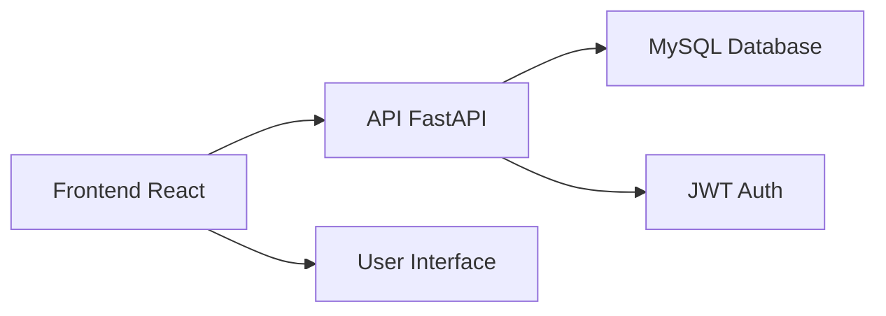

# 🚗 Full Paint Cars (FPC)

<div align="center">

[](https://reactjs.org)
[](https://fastapi.tiangolo.com)
[](https://typescriptlang.org)
[](https://mysql.com)
[](https://opensource.org/licenses/MIT)

**Sistema integral de gestión para talleres de reparación y mantenimiento automotriz**

[Características](#-características-principales) • [Tecnologías](#-tecnologías) • [Inicio Rápido](#-inicio-rápido) • [Arquitectura](#-arquitectura) • [Documentación](#-documentación) • [Contribuir](#-contribuir)

</div>

---

## 📋 Descripción

**Full Paint Cars** es una plataforma completa desarrollada para la gestión integral de talleres automotrices. Combina un frontend moderno en React con un backend robusto en FastAPI, proporcionando una experiencia fluida para clientes, empleados y administradores.

### 🎯 Características Principales

- 🔐 **Sistema de Autenticación** - JWT con refresh tokens y control de roles
- 👥 **Gestión de Usuarios** - Perfiles diferenciados (Cliente, Empleado, Administrador)
- 🚗 **Control de Vehículos** - Registro completo de automóviles y propietarios
- ⚙️ **Procesos de Taller** - Seguimiento de reparaciones y mantenimientos
- 💰 **Sistema de Cotizaciones** - Gestión completa de presupuestos
- 📊 **Dashboard Administrativo** - Estadísticas y reportes en tiempo real
- 📱 **Interfaz Responsiva** - Optimizada para desktop y móvil
- 🔍 **API Documentada** - Swagger UI y ReDoc integrados

---

## 🛠️ Tecnologías

### Frontend
- ⚛️ **React 18** + **TypeScript** - Interfaz de usuario moderna
- ⚡ **Vite** - Herramienta de desarrollo ultrarrápida
- 🎨 **CSS Modular** - Estilos organizados por componentes
- 📱 **Responsive Design** - Adaptable a todos los dispositivos

### Backend
- 🚀 **FastAPI** - Framework web moderno para APIs
- 🐍 **Python 3.8+** - Lenguaje de programación principal
- 🗄️ **SQLAlchemy** - ORM para manejo de base de datos
- 🔒 **JWT Authentication** - Autenticación segura con tokens
- 📚 **Pydantic** - Validación de datos robusta

### Base de Datos
- 🗃️ **MySQL 8.0+** - Base de datos relacional optimizada
- 🔄 **Migraciones** - Control de versiones de esquema
- 📊 **Relaciones** - Estructura normalizada y eficiente

---

## 🚀 Inicio Rápido

### 📋 Prerrequisitos

```bash
# Verificar versiones
node --version    # >= 16.0.0
python --version # >= 3.8.0
mysql --version  # >= 8.0.0
```

### 🔧 Configuración del Proyecto

#### 1️⃣ Clonar el Repositorio

```bash
# Clonar proyecto completo
git clone https://github.com/tu-usuario/full-paint-cars.git
cd full-paint-cars
```

#### 2️⃣ Configurar Backend

```bash
# Navegar al backend
cd backend

# Crear entorno virtual
python -m venv venv
source venv/Scripts/activate  # Windows
# source venv/bin/activate    # macOS/Linux

# Instalar dependencias
pip install -r requirements.txt

# Configurar variables de entorno
cp .env.example .env
# Editar .env con tus configuraciones
```

#### 3️⃣ Configurar Frontend

```bash
# Navegar al frontend (en nueva terminal)
cd frontend

# Instalar dependencias
npm install

# Configurar variables de entorno
cp .env.example .env.local
# Editar .env.local si es necesario
```

#### 4️⃣ Configurar Base de Datos

```sql
-- Crear base de datos
CREATE DATABASE FULLPAINTT CHARACTER SET utf8mb4 COLLATE utf8mb4_unicode_ci;

-- Crear usuario
CREATE USER 'fullpaint_user'@'localhost' IDENTIFIED BY 'tu_password';
GRANT ALL PRIVILEGES ON FULLPAINTT.* TO 'fullpaint_user'@'localhost';
FLUSH PRIVILEGES;
```

### 🏃‍♂️ Ejecutar la Aplicación

#### Backend (Puerto 8000)
```bash
cd backend
uvicorn app.main:app --reload --host 0.0.0.0 --port 8000
```

#### Frontend (Puerto 5173)
```bash
cd frontend
npm run dev
```

### 🌐 Acceder a la Aplicación

- **Frontend**: http://localhost:5173
- **Backend API**: http://localhost:8000
- **Documentación**: http://localhost:8000/docs
- **ReDoc**: http://localhost:8000/redoc

---

## 🏗️ Arquitectura

### 📁 Estructura del Proyecto

```
Full-Paint-Cars/
├── 📁 frontend/                    # React + TypeScript
│   ├── src/
│   │   ├── components/            # Componentes reutilizables
│   │   ├── pages/                 # Páginas principales
│   │   ├── assets/               # Recursos estáticos
│   │   └── styles/               # Estilos CSS
│   └── package.json
│
├── 📁 backend/                     # FastAPI + Python
│   ├── app/
│   │   ├── models/               # Modelos SQLAlchemy
│   │   ├── schemas/              # Esquemas Pydantic
│   │   ├── controllers/          # Lógica de negocio
│   │   ├── routes/               # Endpoints API
│   │   └── auth/                 # Autenticación JWT
│   └── requirements.txt
│
├── 📁 docs/                       # Documentación adicional
└── 📋 README.md                   # Este archivo
```

### 🔄 Flujo de Datos



---

## 👥 Roles del Sistema

### 🔑 Credenciales por Defecto

```json
{
  "correo": "admin@fullpaint.com",
  "password": "Admin123!"
}
```

### 👤 Tipos de Usuario

| Rol | Permisos | Descripción |
|-----|----------|-------------|
| **Cliente** | Consultar servicios, ver historial | Usuario final del taller |
| **Empleado** | Gestionar procesos, actualizar estados | Personal técnico |
| **Administrador** | Control total del sistema | Acceso completo |

---

## 🔗 API Endpoints Principales

### 🔐 Autenticación
- `POST /auth/login` - Iniciar sesión
- `POST /auth/register` - Registrar usuario
- `GET /auth/me` - Información del usuario actual

### 🚗 Gestión de Vehículos
- `GET /automoviles/` - Listar vehículos
- `POST /automoviles/` - Crear vehículo
- `PUT /automoviles/{id}` - Actualizar vehículo

### ⚙️ Procesos de Taller
- `GET /api/v1/procesos/` - Listar procesos
- `POST /api/v1/procesos/` - Crear proceso
- `PATCH /api/v1/procesos/{id}/estado` - Cambiar estado

### 💰 Cotizaciones
- `GET /api/v1/cotizaciones/` - Listar cotizaciones
- `POST /api/v1/cotizaciones/` - Crear cotización
- `GET /api/v1/cotizaciones/estadisticas/dashboard` - Dashboard

---

## 🐳 Docker (Opcional)

### 🚀 Ejecución con Docker Compose

```bash
# Construir y ejecutar todos los servicios
docker-compose up --build -d

# Verificar servicios activos
docker-compose ps

# Ver logs
docker-compose logs -f

# Detener servicios
docker-compose down
```

---

## 📚 Documentación

### 🔗 Enlaces Importantes

| Recurso | URL | Descripción |
|---------|-----|-------------|
| **API Docs** | http://localhost:8000/docs | Documentación interactiva |
| **ReDoc** | http://localhost:8000/redoc | Documentación alternativa |
| **Frontend** | http://localhost:5173 | Aplicación web |
| **Health Check** | http://localhost:8000/health | Estado de la API |

### 📖 Guías Adicionales

- 📘 **[Guía de Instalación](docs/installation.md)** - Instalación detallada
- 🔧 **[Configuración](docs/configuration.md)** - Variables de entorno
- 🚀 **[Despliegue](docs/deployment.md)** - Producción
- 🧪 **[Testing](docs/testing.md)** - Pruebas automatizadas

---

## 🤝 Contribuir

### 📋 Pasos para Contribuir

1. **Fork** del repositorio
2. **Crear rama**: `git checkout -b feature/nueva-funcionalidad`
3. **Commits**: `git commit -m "Add: nueva funcionalidad"`
4. **Push**: `git push origin feature/nueva-funcionalidad`
5. **Pull Request** con descripción detallada

### 🎯 Estándares de Código

- **Frontend**: ESLint + Prettier
- **Backend**: Black + Flake8
- **Commits**: Conventional Commits
- **Testing**: Jest (Frontend) + Pytest (Backend)

---

## 🐛 Soporte

### 🆘 Problemas Comunes

- **Puerto ocupado**: Usar `--port 8001` o `--port 5174`
- **Base de datos**: Verificar MySQL activo y credenciales
- **Dependencias**: Actualizar Node.js y Python a versiones mínimas

### 📞 Contacto

- **Email**: support@fullpaint.com
- **Issues**: [GitHub Issues](https://github.com/tu-usuario/full-paint-cars/issues)
- **Discussions**: [GitHub Discussions](https://github.com/tu-usuario/full-paint-cars/discussions)

---

## 👨‍💻 Equipo de Desarrollo

### 🧑‍💻 Desarrolladores

- **👨‍💻 Oscar Mauricio Cruz Figueroa** - *Fullstack Developer & Documentation*
- **🎨 Maicol Steven Espitia** - *Frontend Developer*
- **🎨 Ronny Borda Ardila** - *Frontend Developer*

---

## 📄 Licencia

Este proyecto está bajo la **MIT License**. Ver [LICENSE](LICENSE) para más detalles.

---

<div align="center">

**🚗 Full Paint Cars - Gestión Integral de Talleres Automotrices 🚗**

[](https://github.com/tu-usuario/full-paint-cars)
[](https://fastapi.tiangolo.com)
[](https://reactjs.org)

---

*¿Encontraste útil este proyecto? ¡Dale una ⭐ en GitHub!*

**[⬆ Volver al inicio](#-full-paint-cars-fpc)**

</div>
