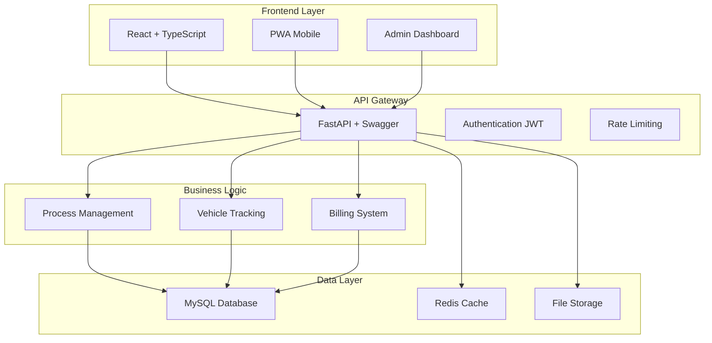

# 🚗 Full Paint Cars (FPC) - Sistema Integral de Gestión Automotriz

<div align="center">


[](https://reactjs.org)
[](https://fastapi.tiangolo.com)
[](https://typescriptlang.org)
[](https://mysql.com)
[](https://opensource.org/licenses/MIT)

**🌟 La solución definitiva para la gestión integral de talleres automotrices 🌟**

*Transforma tu taller con tecnología de vanguardia y experiencia digital excepcional*

[🚀 Demo en Vivo](#-demo-en-vivo) • [✨ Características](#-características-principales) • [⚡ Inicio Rápido](#-inicio-rápido) • [📚 Documentación](#-documentación-completa) • [🤝 Contribuir](#-contribuir)

</div>

---

## 🎯 ¿Qué es FPC?

**Full Paint Cars** es una plataforma revolucionaria que digitaliza y optimiza completamente la gestión de talleres automotrices. Desde el ingreso del vehículo hasta la entrega final, FPC ofrece transparencia total, comunicación en tiempo real y control absoluto sobre todos los procesos.

<div align="center">

| 🏢 **Para tu Taller** | 🌐 **Para tus Clientes** |
|:---:|:---:|
|  |  |
| Control total de procesos y recursos | Seguimiento en tiempo real y comunicación directa |

</div>

---

## ✨ Características Principales

<div align="center">

### 🏆 **Experiencia de Clase Mundial**

</div>

<table>
<tr>
<td width="50%">

#### 🔐 **Sistema de Autenticación Avanzado**
- JWT con refresh tokens automáticos
- Control granular de roles y permisos
- Sesiones seguras multiplataforma
- Autenticación de dos factores (2FA)

#### 🚗 **Gestión Inteligente de Vehículos**
- Registro completo con reconocimiento automático
- Historial detallado por VIN
- Alertas de mantenimiento preventivo
- Base de datos de especificaciones técnicas

#### ⚙️ **Seguimiento de Procesos en Tiempo Real**
- Estados visuales interactivos
- Timeline detallado por fase
- Asignación automática de técnicos
- Estimaciones de tiempo precisas

</td>
<td width="50%">

#### 💬 **Comunicación Bidireccional**
- Chat en tiempo real con notificaciones push
- Galería de fotos del progreso
- Videollamadas integradas
- Sistema de tickets de soporte

#### 💰 **Sistema de Cotizaciones Inteligente**
- Generación automática de presupuestos
- Comparación de precios en tiempo real
- Aprobación digital de trabajos
- Integración con métodos de pago

#### 📊 **Analytics y Reportes Avanzados**
- Dashboard ejecutivo en tiempo real
- KPIs automatizados
- Reportes personalizables
- Análisis predictivo de demanda

</td>
</tr>
</table>

---

## 🌟 Capturas de Pantalla

<div align="center">

### 📱 **Interfaz Móvil Responsiva**


*Experiencia optimizada para dispositivos móviles*

### 💻 **Dashboard Administrativo**


*Panel de control con métricas en tiempo real*

### 🔧 **Seguimiento de Procesos**


*Vista detallada del progreso de reparaciones*

</div>

---

## 🏗️ Arquitectura del Sistema

<div align="center">



*Arquitectura escalable y moderna basada en microservicios*

</div>

---

## 🚀 Demo en Vivo

<div align="center">

### 🌐 **Prueba FPC Ahora Mismo**

[](https://fpc-demo.vercel.app)

**Credenciales de Prueba:**
```json
{
  "admin": {
    "correo": "admin@fullpaint.com",
    "password": "Admin123!"
  },
  "cliente": {
    "correo": "cliente@ejemplo.com", 
    "password": "Cliente123!"
  }
}
```

### 📊 **Endpoints de la API**

[](http://localhost:8000/docs)
[](http://localhost:8000/redoc)

</div>

---

## ⚡ Inicio Rápido

### 🐳 **Instalación con Docker (Recomendado)**

```bash
# 1️⃣ Clonar el repositorio
git clone https://github.com/tu-usuario/full-paint-cars.git
cd full-paint-cars

# 2️⃣ Configurar variables de entorno
cp .env.example .env
# Editar .env con tus configuraciones

# 3️⃣ Levantar todos los servicios
docker-compose up -d

# 4️⃣ Verificar que todo esté funcionando
docker-compose ps
```

### 💻 **Instalación Manual**

<details>
<summary>🔧 <strong>Configuración Paso a Paso</strong></summary>

#### Prerrequisitos
```bash
node --version    # >= 18.0.0
python --version  # >= 3.9.0
mysql --version   # >= 8.0.0
```

#### Backend Setup
```bash
cd backend
python -m venv venv
source venv/Scripts/activate  # Windows
pip install -r requirements.txt

# Configurar base de datos
mysql -u root -p
CREATE DATABASE FULLPAINTT CHARACTER SET utf8mb4 COLLATE utf8mb4_unicode_ci;

# Ejecutar migraciones
python -m alembic upgrade head

# Iniciar servidor
uvicorn app.main:app --reload --port 8000
```

#### Frontend Setup
```bash
cd frontend
npm install
npm run dev
```

</details>

### 🌐 **Acceso a la Aplicación**

| Servicio | URL | Descripción |
|----------|-----|-------------|
| 🖥️ **Frontend** | http://localhost:5173 | Aplicación principal |
| 🚀 **API Backend** | http://localhost:8000 | Servidor de API |
| 📚 **Documentación** | http://localhost:8000/docs | Swagger UI |
| 📊 **Monitoreo** | http://localhost:3000 | Dashboard de métricas |

---

## 🛠️ Stack Tecnológico

<div align="center">

### **Frontend Moderno**


### **Backend Robusto**


### **Base de Datos y Cache**


### **DevOps y Deployment**


</div>

---

## 👥 Roles y Permisos

<div align="center">

| 👤 Rol | 🔑 Permisos | 📋 Responsabilidades |
|:------:|:-----------:|:-------------------:|
| **🎯 Administrador** | Control total del sistema | Gestión de usuarios, configuración, reportes ejecutivos |
| **👨‍🔧 Empleado Técnico** | Gestión de procesos y vehículos | Actualización de estados, comunicación con clientes |
| **👨‍💻 Cliente** | Consulta y seguimiento | Monitoreo de su vehículo, comunicación con taller |

</div>

---

## 📚 Documentación Completa

<div align="center">

### 📖 **Guías Detalladas**

</div>

<table>
<tr>
<td width="50%">

#### 🗂️ **Modelado y Diseño**
- 📊 [Casos de Uso](docs/casos-de-uso/)
- 🏗️ [Diagrama de Clases](docs/diagramas/clases/)
- 🚀 [Diagrama de Despliegue](docs/diagramas/despliegue/)
- 🗃️ [Modelo Entidad-Relación](docs/base-datos/er/)
- 🔄 [Mapas de Procesos](docs/procesos/)

#### 🛠️ **Implementación Técnica**
- 💾 [Scripts SQL (DDL)](docs/base-datos/ddl/)
- 📝 [Diccionario de Datos](docs/base-datos/diccionario/)
- ⚙️ [Procedimientos BD](docs/base-datos/procedimientos/)
- 🧪 [Datos de Prueba](docs/base-datos/datos-ejemplo/)

</td>
<td width="50%">

#### 📐 **Estándares y Normas**
- 📋 [IEEE 830 - Especificación](docs/normas/ieee-830/)
- 🔧 [Normalización BD](docs/base-datos/normalizacion/)
- 💰 [Sistema de Cotizaciones](docs/cotizaciones/)
- 🎨 [Guía de UI/UX](docs/diseno/ui/)

#### 💡 **Diseño Visual**
- 🖼️ [Mockups Interactivos](docs/mockups/)
- 🎨 [Prototipado](docs/prototipo/)
- 📱 [Responsive Design](docs/diseno/responsive/)
- 📊 [Presentaciones SENA](docs/presentaciones/)

</td>
</tr>
</table>

---

## 🧪 Testing y Calidad

<div align="center">

### **Cobertura de Pruebas**


</div>

```bash
# Ejecutar suite completa de pruebas
npm run test:all

# Pruebas frontend
npm run test:frontend

# Pruebas backend  
pytest --cov=app tests/

# Pruebas E2E
npm run test:e2e
```

---

## 🚀 Roadmap y Nuevas Características

<div align="center">

### **🎯 Próximas Funcionalidades**

</div>

- [ ] 🤖 **IA para Diagnóstico Automático** - Análisis inteligente de problemas
- [ ] 📱 **App Móvil Nativa** - iOS y Android con notificaciones push
- [ ] 🌍 **Multiidioma** - Soporte para inglés, portugués y francés
- [ ] 📊 **Analytics Avanzados** - Machine Learning para predicciones
- [ ] 🔗 **Integración ERP** - Conexión con sistemas empresariales
- [ ] 💳 **Pagos Digitales** - PayPal, Stripe, criptomonedas
- [ ] 📞 **VoIP Integrado** - Llamadas directas desde la plataforma
- [ ] 🎥 **Realidad Aumentada** - Visualización 3D de reparaciones

---

## 🤝 Contribuir

<div align="center">

### **🌟 ¡Tu Contribución es Valiosa!**

[](https://github.com/tu-usuario/full-paint-cars/graphs/contributors)
[](https://github.com/tu-usuario/full-paint-cars/forks)
[](https://github.com/tu-usuario/full-paint-cars/stargazers)

</div>

### 📋 **Guía de Contribución**

1. **🍴 Fork** del repositorio
2. **🌿 Crear rama**: `git checkout -b feature/nueva-funcionalidad`
3. **✍️ Commit**: `git commit -m "feat: agregar nueva funcionalidad"`
4. **📤 Push**: `git push origin feature/nueva-funcionalidad`
5. **🔀 Pull Request** con descripción detallada

### 🎯 **Estándares de Código**

- **Frontend**: ESLint + Prettier + Husky
- **Backend**: Black + Flake8 + MyPy
- **Commits**: [Conventional Commits](https://www.conventionalcommits.org/)
- **Testing**: Jest (Frontend) + Pytest (Backend)


## 🐛 Soporte y Comunidad

<div align="center">

### **💬 Canales de Comunicación**

[](https://discord.gg/fpc-community)
[](https://t.me/fpc_support)
[](https://github.com/tu-usuario/full-paint-cars/issues)

</div>

### 🆘 **Problemas Comunes**

<details>
<summary>🔧 <strong>Soluciones Rápidas</strong></summary>

**Puerto ocupado:**
```bash
# Backend alternativo
uvicorn app.main:app --port 8001

# Frontend alternativo  
npm run dev -- --port 5174
```

**Error de base de datos:**
```bash
# Verificar MySQL
systemctl status mysql

# Reiniciar servicios
docker-compose restart db
```

**Problemas de permisos:**
```bash
# Linux/macOS
sudo chown -R $USER:$USER .

# Windows (PowerShell como Admin)
icacls . /grant %USERNAME%:F /T
```

</details>

---

## 👨‍💻 Equipo de Desarrollo

<div align="center">

### **🌟 Los Cerebros Detrás de FPC**

<table>
<tr>
<td align="center" width="33%">

<br>
<strong>👨‍💻 Oscar Mauricio Cruz</strong>
<br>
<em>Fullstack Developer & Tech Lead</em>
<br>
<a href="https://github.com/Zarpien06">GitHub</a> • 
<a href="www.linkedin.com/in/oscarcruz-dev">LinkedIn</a>
</td>
<td align="center" width="33%">

<br>
<strong>🎨 Maicol Steven Espitia</strong>
<br>
<em>Frontend Developer & UI/UX</em>
<br>
<a href="https://github.com/maicol-espitia">GitHub</a> • 
<a href="https://linkedin.com/in/maicol-espitia">LinkedIn</a>
</td>
<td align="center" width="33%">

<br>
<strong>💼 Ronny Borda Ardila</strong>
<br>
<em>Frontend Developer & QA</em>
<br>
<a href="https://github.com/ronny-borda">GitHub</a> • 
<a href="https://linkedin.com/in/ronny-borda">LinkedIn</a>
</td>
</tr>
</table>

### 🎓 **Formación Académica**

**Tecnólogo en Análisis y Desarrollo de Software**  
*SENA - Servicio Nacional de Aprendizaje*  
*Bogotá, Colombia • 2025*

</div>

---

## 📄 Licencia

<div align="center">

Este proyecto está licenciado bajo la **MIT License**.

[](https://opensource.org/licenses/MIT)

*¿Encontraste útil este proyecto? ¡Dale una ⭐ en GitHub!*

</div>

---

<div align="center">

## 🎉 **¡Gracias por Elegir FPC!**

**🚗 Full Paint Cars - Revolucionando la Gestión Automotriz 🚗**

[](https://github.com/tu-usuario/full-paint-cars)

### 📞 **Contacto**
**Email:** [contacto@fullpaintcars.com](mailto:contacto@fullpaintcars.com)  
**Sitio Web:** [www.fullpaintcars.com](https://fullpaintcars.com)  
**Ubicación:** Bogotá, Colombia 🇨🇴

---

**[⬆ Volver al inicio](#-full-paint-cars-fpc---sistema-integral-de-gestión-automotriz)**

*© 2025 Full Paint Cars. Todos los derechos reservados.*

</div>
